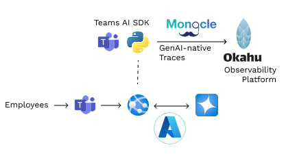

# Basic AI Chatbot for Employees in Teams

This M365 agentic app is built on top of [Teams AI library](https://aka.ms/teams-ai-library) demonstrates how open-source [Monocle](#about-monocle) and [Okahu Cloud](#about-okahu) is used to monitor AI-enabled automated experiences. 

### About Monocle 



[Monocle](http://monocle2ai.org/) is a GenAI-native community driven open source project created to simplify instrumentation of AI apps so app developers can built high impact, safe and reliable AI apps. 

Monocle is currently a [Sandbox](https://lfaidata.foundation/projects/monocle/) project in Linux Foundation AI & Data. In it's first iteration, Monocle helps app developers make GenAI apps observable without having to write last-mile monitoring code. 

### About Okahu Cloud 

[Okahu Cloud](http://portal.okahu.co/) is a GenAI-native observability platform that simplifies observability & evals required for taking agentic and LLM based apps from lab into prod. 

Okahu Cloud is built by a team of AI, observability and cloud engineers from [Okahu](https://www.okahu.ai). Okahu is a VC funded bay area startup founded by Stanford, Microsoft & BlueTalon to help AI app developers, platform engineers and engineering leaders to build reliable, accurate and safer AI apps.

#### Requirement
1. VS Code IDE 
1. Microsoft 365 Agents Toolkit for VS Code
1. Monocle extension for VS Code

### Configure
1. In VS Code, open the command box and enter `Python: Create Environment` to create and activate your desired virtual environment. Remember to select `src/requirements.txt` as dependencies to install when creating the virtual environment.
1. Create a file `env/.env.playground.user` and enter the following environment variables: 
```
AZURE_OPENAI_API_KEY=
AZURE_OPENAI_MODEL_DEPLOYMENT_NAME=
AZURE_OPENAI_ENDPOINT=
OKAHU_API_KEY=
```


### Conversation with agent
1. Select the Microsoft 365 Agents Toolkit icon on the left in the VS Code toolbar.
1. Press F5 to start debugging which launches your app in Teams using a web browser. Select `Debug in Microsoft 365 Agent Playground`.
1. You will receive a welcome message from the agent, or send any message to get a response.

### Observability of agent 
1. Open Okahu Cloud Portal (http://portal.okahu.co) and click `Discover` under Applications > Components tab. 
2. Visualize traces from `Traces` tab and prompts from `Prompts` tab. 
3. Add a new application from `Applications` navigation to view insights. 

**Congratulations**! You are running an application that can now interact with users in Teams and monitor how it works using Okahu Cloud. 

### Experiment

| File                                 | Changes                                           |
| - | - |
|`src/prompts/chat/skprompt.txt`| Change the system/developer prompt to alter your bot.|
|`src/prompts/chat/config.json`| Configures the prompt.|


[^1]: Use of Okahu hosted demo is covered by Okahu's [terms of service for evaluations](https://www.okahu.ai/agreements/evaluation-agreement). 
  [Okahu](https://www.okahu.ai) is a team of AI, observability & cloud engineers working to simplify observability for agentic and other GenAI apps. We serve AI app developers, platform engineers and engineering leaders to build reliable, accurate and safer AI apps. We believe in community driven open source software and are a major contributor to GenAI native observability Project Monocle hosted by Linux Foundation.
  Connect with us on [Linkedin](https://www.linkedin.com/company/99272699/admin/dashboard/), [Github](https://github.com/okahu) or email us at <dx@okahu.ai>

